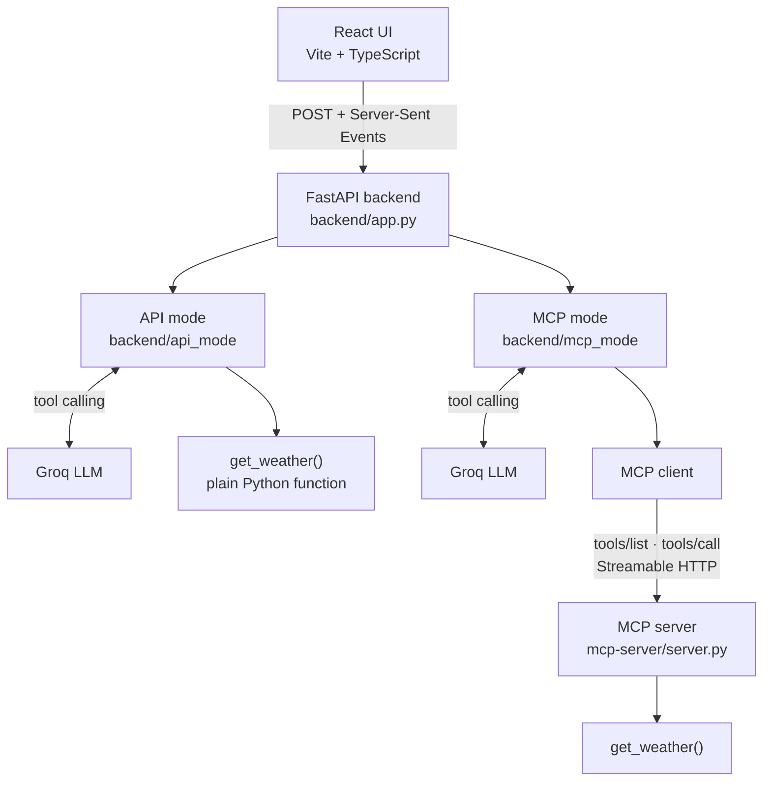
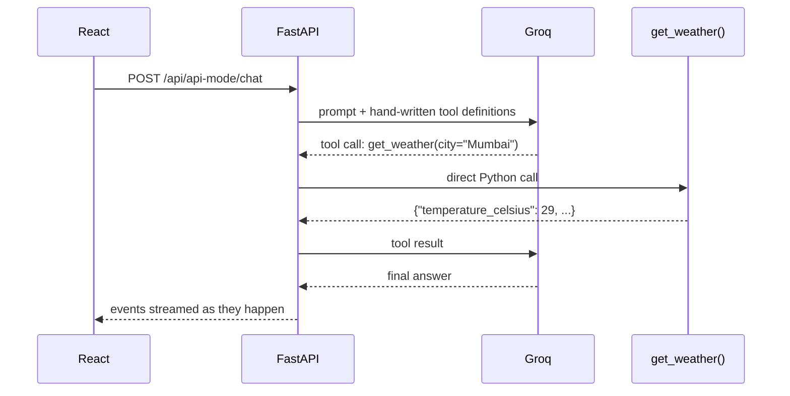
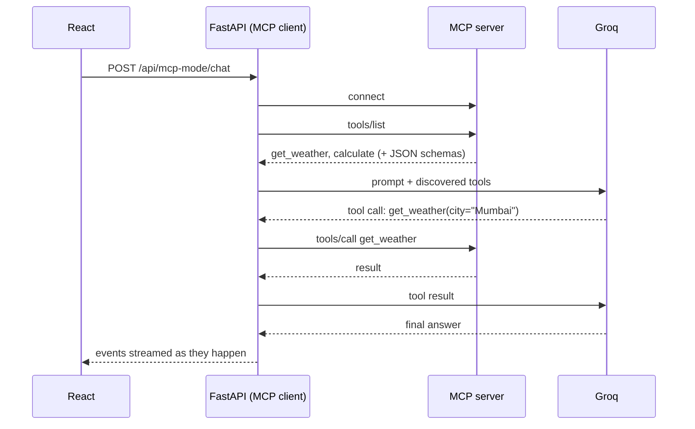

# MCP vs API Workshop

**Same AI task. Two different ways to connect capabilities.**

An interactive, open-source workshop that runs the *same* AI request through a traditional API integration and through the [Model Context Protocol (MCP)](https://modelcontextprotocol.io), side by side, and shows every step as it happens.


---

## Contents

- [Why this project?](#why-this-project)
- [What you&#39;ll learn](#what-youll-learn)
- [Demo](#demo)
- [Architecture](#architecture)
- [Project Structure](#project-structure)
- [Requirements](#requirements)
- [Quick Start](#quick-start)
- [Automated Setup](#automated-setup)
- [Manual Setup](#manual-setup)
- [Configure Groq](#configure-groq)
- [Running the Application](#running-the-application)
- [Deploy to Vercel](#deploy-to-vercel)
- [Using the Simulator](#using-the-simulator)
- [Understanding API Mode](#understanding-api-mode)
- [Understanding MCP Mode](#understanding-mcp-mode)
- [Hands-on Exercises](#hands-on-exercises)
- [Build Your Own MCP Tool](#build-your-own-mcp-tool)
- [Contributing](#contributing)
- [Pull Request Workflow](#pull-request-workflow)
- [Running the Tests](#running-the-tests)
- [Troubleshooting](#troubleshooting)
- [FAQ](#faq)
- [License](#license)

---

## Why this project?

"MCP vs API" is often framed as a competition. It isn't one.

- An **API** lets an application call a service or function. The application controls the integration.
- **MCP** is a standardized protocol that lets an AI application *discover* and *call* capabilities exposed by an MCP server.

> **MCP does not replace APIs.** An MCP tool can itself call a REST API, a database, an internal service, a SaaS API, files or custom logic. MCP can sit above APIs.

This repository makes that difference visible. You ask one question, click **Run Both**, and watch two real execution paths stream into the browser.

## What you'll learn

1. **Traditional API integration:** the application defines tools and calls them directly.
2. **LLM tool calling:** the model decides *when* a capability is needed.
3. **MCP-based integration:** tools are discovered with `tools/list` and invoked with `tools/call` through a standard protocol.
4. How to **add your own MCP tool**, test it and contribute it back with a pull request.

## Demo

Default prompt: **"What's the weather in Mumbai?"**

```text
API                                   MCP

POST /api/api-mode/chat               MCP client initialized
        ↓                                     ↓
      Groq                               tools/list
        ↓                                     ↓
get_weather(city="Mumbai")         get_weather, calculate discovered
        ↓                                     ↓
Mumbai · 29°C · Partly cloudy        Groq decides to use get_weather
        ↓                                     ↓
  Final response                         tools/call
                                              ↓
                                     MCP server runs get_weather
                                              ↓
                                   Mumbai · 29°C · Partly cloudy
                                              ↓
                                        Final response
```

Two tools are available: `get_weather(city)` and `calculate(expression)`.
Weather is deterministic **demo data, not live weather**, for Mumbai, Delhi, Bangalore, London, New York and Singapore (other cities get a fixed fallback). No weather API key is needed.

## Architecture



**API mode**



**MCP mode**



More detail: [docs/architecture.md](docs/architecture.md).

## Project Structure

```text
mcp-vs-api-demo/
├── frontend/                 React + Vite + TypeScript + Tailwind
│   ├── src/
│   │   ├── components/       Timeline, ModePanel, ArchitectureView, ...
│   │   ├── pages/            Home, Simulator, Workshop, Exercises
│   │   ├── lib/              API client, SSE parser, timeline logic, presets
│   │   └── types/            Event types shared with the backend
│   └── scripts/run-tests.mjs Zero-dependency test runner (Vite + node:test)
│
├── backend/                  FastAPI app, run with `python app.py`
│   ├── app.py                Endpoints + Server-Sent Events streaming
│   ├── api_mode/             tools.py (hand-written tools) + service.py
│   ├── mcp_mode/             client.py (MCP client) + service.py
│   ├── shared/               config, Groq client, events, demo data
│   └── tests/
│
├── mcp-server/               The MCP server, run with `python server.py`
│   ├── server.py             create → register → implement → run
│   ├── tools.py              Plain Python tool implementations
│   └── tests/
│
├── docs/                     Workshop, architecture, exercises, guides
├── .github/                  PR + issue templates, CI workflow
├── setup.py                  One-command setup (and optional --run)
└── .env.example              Reference for every environment variable
```

## Requirements

| Tool         | Version                            | Check with                                            |
| ------------ | ---------------------------------- | ----------------------------------------------------- |
| Python       | 3.10 or newer                      | `python --version`                                  |
| Node.js      | 20.19+ or 22.12+ (LTS recommended) | `node --version`                                    |
| npm          | comes with Node.js                 | `npm --version`                                     |
| Groq API key | free                               | [console.groq.com/keys](https://console.groq.com/keys) |

No Docker, database or weather API key needed. On macOS/Linux you may need to type `python3` instead of `python`.

## Quick Start

```bash
git clone https://github.com/jars-demo/mcp-vs-api-demo.git
cd mcp-vs-api-demo

python setup.py
```

Then add your key to **`backend/.env`**:

```env
GROQ_API_KEY=your-groq-key
```

Now open **three terminals** from the project folder.

### Terminal 1: MCP server

Windows:

```bash
cd mcp-server
.venv\Scripts\activate
python server.py
```

macOS/Linux:

```bash
cd mcp-server
source .venv/bin/activate
python server.py
```

### Terminal 2: backend

Windows:

```bash
cd backend
.venv\Scripts\activate
python app.py
```

macOS/Linux:

```bash
cd backend
source .venv/bin/activate
python app.py
```

### Terminal 3: frontend

```bash
cd frontend
npm run dev
```

Open **http://localhost:5173/simulator** and click **Run Both**.

> Prefer one terminal? `python setup.py --run` starts all three services together (optional, Ctrl+C stops them).

## Automated Setup

`python setup.py` is safe to run as often as you like. It:

1. Detects your operating system.
2. Checks Python (3.10+), Node.js (20.19+) and npm, and explains exactly what is missing. It never installs system software.
3. Creates `backend/.venv` and installs `backend/requirements.txt`.
4. Creates `mcp-server/.venv` and installs `mcp-server/requirements.txt`.
5. Runs `npm install` in `frontend/`.
6. Creates `backend/.env` and `mcp-server/.env` from their `.env.example` files (existing files are never overwritten).
7. Prints the next steps for your OS.

It never deletes anything, and it skips dependencies that are already installed.

## Manual Setup

Prefer to do it by hand? These are the same steps `setup.py` runs.

<details>
<summary><strong>What is a virtual environment?</strong></summary>

A virtual environment (`.venv`) is a private folder of Python packages for one project, so this workshop's packages don't clash with anything else on your machine. You create it once, then **activate** it in each new terminal before running `python`. When it's active, your prompt shows `(.venv)`.

</details>

### Backend

Windows:

```bash
cd backend
python -m venv .venv
.venv\Scripts\activate
pip install -r requirements.txt
copy .env.example .env
python app.py
```

macOS/Linux:

```bash
cd backend
python3 -m venv .venv
source .venv/bin/activate
pip install -r requirements.txt
cp .env.example .env
python app.py
```

### MCP server

Windows:

```bash
cd mcp-server
python -m venv .venv
.venv\Scripts\activate
pip install -r requirements.txt
copy .env.example .env
python server.py
```

macOS/Linux:

```bash
cd mcp-server
python3 -m venv .venv
source .venv/bin/activate
pip install -r requirements.txt
cp .env.example .env
python server.py
```

The MCP server uses the **Streamable HTTP** transport and listens on `http://127.0.0.1:8001/mcp`.

### Frontend

```bash
cd frontend
npm install
npm run dev          # development server on http://localhost:5173
```

Production build:

```bash
npm run build
npm start            # serves the production build on http://localhost:4173
```

Both `npm run dev` and `npm start` forward `/api` and `/health` to the backend, so the browser never talks to Groq directly.

## Configure Groq

1. Create a free key at [console.groq.com/keys](https://console.groq.com/keys).
2. Put it in `backend/.env`:

   ```env
   GROQ_API_KEY=your-groq-key
   GROQ_MODEL=openai/gpt-oss-120b
   MCP_SERVER_URL=http://127.0.0.1:8001/mcp
   BACKEND_PORT=8000
   ```
3. Restart the backend.

A `.env` in the project root also works: the backend falls back to it for any value that is empty in `backend/.env`.

`GROQ_MODEL` can be any Groq model that supports tool calling (see [Groq&#39;s model list](https://console.groq.com/docs/models)).

**Security:** the key is only read by the Python backend. It is never sent to the browser, never logged, and `.env` is git-ignored. There is deliberately no `VITE_GROQ_API_KEY`, because anything prefixed `VITE_` is bundled into public JavaScript.

## Running the Application

| Service         | Command                                                | URL                                       |
| --------------- | ------------------------------------------------------ | ----------------------------------------- |
| MCP server      | `python server.py` (in `mcp-server/`, venv active) | http://127.0.0.1:8001/mcp                 |
| Backend         | `python app.py` (in `backend/`, venv active)       | http://127.0.0.1:8000 · docs at`/docs` |
| Frontend (dev)  | `npm run dev` (in `frontend/`)                     | http://localhost:5173                     |
| Frontend (prod) | `npm run build && npm start`                         | http://localhost:4173                     |

Health check: `curl http://127.0.0.1:8000/health` → `{"status":"ok"}`

## Deploy to Vercel

[](<https://vercel.com/new/clone?repository-url=https%3A%2F%2Fgithub.com%2Fjars-demo%2Fmcp-vs-api-demo&project-name=mcp-vs-api&env=GROQ_API_KEY&envDescription=Groq%20API%20key%20(stays%20server-side)&envLink=https%3A%2F%2Fconsole.groq.com%2Fkeys>)

One click: Vercel clones the repo, asks for `GROQ_API_KEY`, then builds and deploys. Everything is already configured in [`vercel.json`](vercel.json):

- the React build is served as static files (`frontend/dist`)
- `/api/*` and `/health` go to one Python function ([`api/index.py`](api/index.py)) that runs the FastAPI backend
- optional env var: `GROQ_MODEL` (default `openai/gpt-oss-120b`)

**How MCP runs on Vercel:** serverless functions can't keep a separate MCP server process alive, so the deployed backend loads `mcp-server/server.py` in the same process (`MCP_TRANSPORT=inprocess`). It still speaks MCP (`tools/list`, `tools/call`); only the network hop is gone, and the timeline says so. Run locally to show the full three-process setup.

**Custom domain:** in the Vercel project open *Settings → Domains*, add your subdomain (e.g. `mcp-vs-api.example.com`), then add the DNS record Vercel shows you (usually a `CNAME` to `cname.vercel-dns.com`).

> A public deployment uses **your** Groq key for every visitor. Groq's free-tier limits cap usage, but keep an eye on it or remove the deployment after the event.

## Using the Simulator

1. Go to **/simulator**. The header shows **Backend**, **MCP Server** and **Groq** status.
2. Pick a preset or type a prompt:
   - What's the weather in Mumbai? / London? / Singapore?
   - What is 42 × 17? (the model picks `calculate`)
   - Tell me a joke. (the model uses **no** tool, and the tool steps show as *Skipped*)
3. Click **Run API**, **Run MCP** or **Run Both** (or press Enter).
4. Click any step to expand the real payload the backend sent.
5. Turn on **Presenter Mode** to show request payloads, auto-expanded `tools/list` / `tools/call`, timestamps, file names in the architecture view and the raw event stream.

Nothing in the timeline is simulated. Each row is an event streamed by FastAPI as that step happens.

## Understanding API Mode

**The application controls the integration.**

- Tool definitions are written by hand in [`backend/api_mode/tools.py`](backend/api_mode/tools.py).
- The backend sends them to Groq. Groq decides whether a tool is needed.
- When Groq asks for `get_weather`, the backend calls its **own Python function** directly.
- Adding a tool means editing the backend.

Code: [`backend/api_mode/service.py`](backend/api_mode/service.py)

## Understanding MCP Mode

**The AI application discovers standardized capabilities exposed by an MCP server.**

1. The backend's MCP client connects to the MCP server.
2. `tools/list` returns every tool with its JSON Schema.
3. Those tools are converted to Groq's tool format. Nothing is hard-coded.
4. Groq chooses a tool.
5. `tools/call` runs it on the MCP server.
6. The result goes back to Groq for the final answer.

Adding a tool means editing **only the MCP server**. The backend discovers it automatically.

Code: [`mcp-server/server.py`](mcp-server/server.py) · [`backend/mcp_mode/service.py`](backend/mcp_mode/service.py) · [`backend/mcp_mode/client.py`](backend/mcp_mode/client.py)

| Concept                 | API Integration            | MCP                                 |
| ----------------------- | -------------------------- | ----------------------------------- |
| Primary abstraction     | Endpoint / function        | Protocol                            |
| Tool discovery          | Application-defined        | Standardized MCP mechanism          |
| Invocation              | Application / API call     | MCP tool call                       |
| Reusability             | Depends on the integration | Designed for reusable tool exposure |
| Can use APIs internally | Yes                        | Yes                                 |
| AI-specific protocol    | Not necessarily            | Yes                                 |

Neither approach is automatically better. They solve different problems, and they often work together:

```text
MCP Server → get_weather()   → could call → REST API
MCP Server → get_customer()  → could call → PostgreSQL
MCP Server → create_ticket() → could call → Jira API
```

## Hands-on Exercises

Full instructions with hints and solutions: **/exercises** in the app, or [docs/exercises.md](docs/exercises.md).

1. **Add `get_time(city)`**: create, describe, register, discover and invoke a new MCP tool.
2. **Add `get_exchange_rate(from_currency, to_currency)`**: a two-argument tool with validation and demo rates.

## Build Your Own MCP Tool

```text
Fork → branch → add your MCP tool → update docs → test → commit → push → Pull Request
```

Ideas that need no secrets: `convert_units()`, `get_random_quote()`, `search_documentation()`, `get_github_repo_info()` (public API), `search_local_events()` (local JSON).
See [docs/extending.md](docs/extending.md) for exactly which files to touch.

## Contributing

Contributions are welcome, especially new tools, exercises and docs improvements. Start with [docs/contributing.md](docs/contributing.md).

## Pull Request Workflow

```bash
# 1. Fork on GitHub, then:
git clone https://github.com/<you>/mcp-vs-api-demo.git
cd mcp-vs-api-demo
git checkout -b feat/my-mcp-tool
python setup.py

# 2. Add your tool + tests + docs, then:
git add .
git commit -m "feat: add unit converter MCP tool"
git push origin feat/my-mcp-tool
# 3. Open a Pull Request on GitHub. The template asks what/why/how tested.
```

## Running the Tests

```bash
# Backend (venv active)
cd backend && python -m pytest

# MCP server (venv active)
cd mcp-server && python -m pytest

# Frontend
cd frontend && npm test && npm run build
```

Tests never call the real Groq API: a scripted fake model stands in, so no key is needed. The same checks run on GitHub Actions ([`.github/workflows/test.yml`](.github/workflows/test.yml)).

## Troubleshooting

| Symptom                                          | Fix                                                                                                                                                                                                      |
| ------------------------------------------------ | -------------------------------------------------------------------------------------------------------------------------------------------------------------------------------------------------------- |
| **"Groq API key not configured."**         | Add`GROQ_API_KEY` to `backend/.env` (or the root `.env`), then restart `python app.py`.                                                                                                          |
| **"Backend unavailable."**                 | Start the backend (Terminal 2). Check http://127.0.0.1:8000/health.                                                                                                                                      |
| **"MCP server unavailable."**              | Start the MCP server (Terminal 1). The header should show*MCP Server ● Connected*.                                                                                                                    |
| `python` not found (macOS/Linux)               | Use`python3` (for example `python3 setup.py`).                                                                                                                                                       |
| `.venv\Scripts\activate` blocked (PowerShell)  | Run`Set-ExecutionPolicy -Scope CurrentUser RemoteSigned` once, or use Command Prompt.                                                                                                                  |
| `ModuleNotFoundError`                          | Your venv isn't active. Activate it (see above) or run`python setup.py`.                                                                                                                               |
| Port already in use                              | Change`BACKEND_PORT` in `backend/.env` (and set `BACKEND_URL=http://127.0.0.1:<port>` before `npm run dev`) or `MCP_PORT` in `mcp-server/.env` (and `MCP_SERVER_URL` in `backend/.env`). |
| **"Groq could not complete the request."** | Occasionally a model emits a malformed tool call. Run again, or try another`GROQ_MODEL`.                                                                                                               |
| **"Groq rate limit reached."**             | Free tier limits. Wait a few seconds.                                                                                                                                                                    |
| Frontend blank / Node errors                     | Node 20.19+ is required:`node --version`.                                                                                                                                                              |

Turn on **Presenter Mode** to see the technical error detail for any failure.

## FAQ

**Is MCP a replacement for REST APIs?**
No. MCP standardizes how AI applications discover and call tools. The tools themselves often call APIs.

**Is MCP faster or better than calling a function directly?**
This project makes no such claim. Both paths are shown so you can compare *architecture*, not declare a winner.

**Is the MCP mode real?**
Yes. The backend is a genuine MCP client (official Python SDK) talking to a separate MCP server process over Streamable HTTP. It never imports the server's code.

**Why does the backend (not the browser) talk to MCP and Groq?**
To keep the API key on the server and keep the frontend simple.

**Why is the weather fake?**
So the workshop is free, deterministic and works offline (apart from Groq). Replacing `get_weather()` with a real weather API is a good extension exercise.

**Can I use another LLM?**
Yes. Only `backend/shared/groq_client.py` knows about Groq. Any provider with tool calling can be swapped in.

## License

[MIT](LICENSE)
